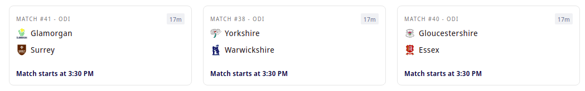
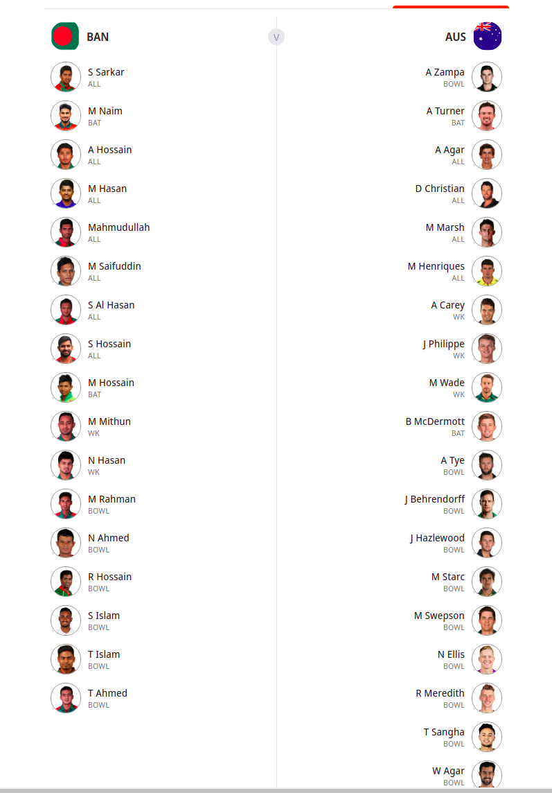

# Sport Monks Challenge

Get the data from the Sport Monks api for Fixture and display it like in the design

- Fixture Endpoint URL: `https://cricket.sportmonks.com/api/v2.0/fixtures`

- Teams Endpoint URL: `https://cricket.sportmonks.com/api/v2.0/teams/{ID}/squad/{season_ID}`

- Api Key: `muOI4XxFJNQbGqxH4Tz5JEKH3F5gtIWxW6KXNaxmZdOr0yczvPpmb85FbN2S`
- Api Docs: `https://docs.sportmonks.com/cricket/`
- Api Postman Collection: `https://cricket-postman.sportmonks.com/`

## Task

1. Get all fixture data with local and visitor team (Use Fixtures endpoint)
2. Display it like in the design
3. On click of the match details it should show the list of players of local and visitor team (Use Teams endpoint)

## Fixture listing design

## Team listing design

